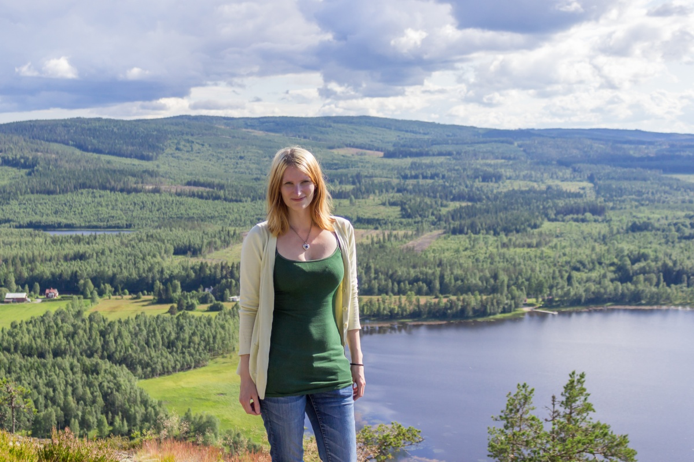
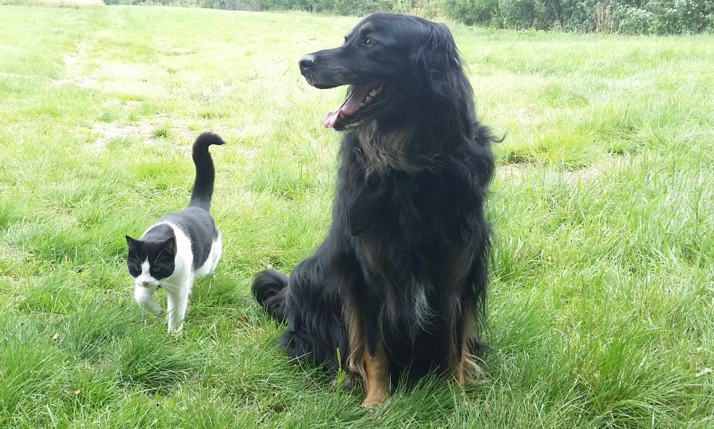

---
titleBreadcrumb: Hem
...
Om mig själv
===============================

Jag heter Therese Eriksson, 32 år och är född i Örnsköldsvik, även nuvarande boplats.
Jag läste Media på gymnasiet med grafisk inriktning. Jag har även bott ett år i Sundsvall och Bollnäs,
där har jag studerat inom grafisk design och kommunikation, samt webdesign.
Men har tyvärr hoppat av båda gångerna pga personliga skäl. Så nu kör vi på "tredje gången gillt" och jag har en känsla av att det
kommer gå bättre nu när jag kör via distans istället. 

Just nu bor jag en bit utanför stan på landet med min sambo och mina 2 håriga barn
Harry och Zero (hund och katt). Jag flyttade in till min sambos hus förra sommaren och
man kan inte annat än att trivas här, det är lugnt och harmoniskt och man har älven rinnandes ca 10 meter från
huset, samt en badstrand ca 300 meter bort. Enda
nackdelen med att bo som vi gör är alla dessa spindlar och mygg som ska vara överallt,
tyvärr lider jag av spindelfobi och myggen älskar mitt blod vilket inte uppskattas.

Kommer nog att studera mestadels i Stockholm under utbildningens tid, då min sambo
har börjat jobba där nere. Men såklart behåller vi huset, man måste ju ha något fint att
längta hem till.

Jag tycker om att hålla på med hemsidor, men då jag mestadels bara kan html och css så
blir man rätt begränsad. Ser framemot att äntligen kunna utöka mina kunskaper inom fler
områden. Har försökt göra det på egen hand, men eftersom det är svårt att hitta ett bra
upplägg själv så ville jag prova en utbildning istället. 

Annars tycker jag om att fota och vara ute i naturen, gärna i kombination med varandra.
Gillar även att ta det lugnt med en bra film eller serie (varav jag måste skryta om att
min sambo har byggt en egen liten biosalong) och spela spel
(är en liten spelnörd tyvärr, men ska tygla mig så det inte stör studierna). 

{width=450px}

{width=450px}
